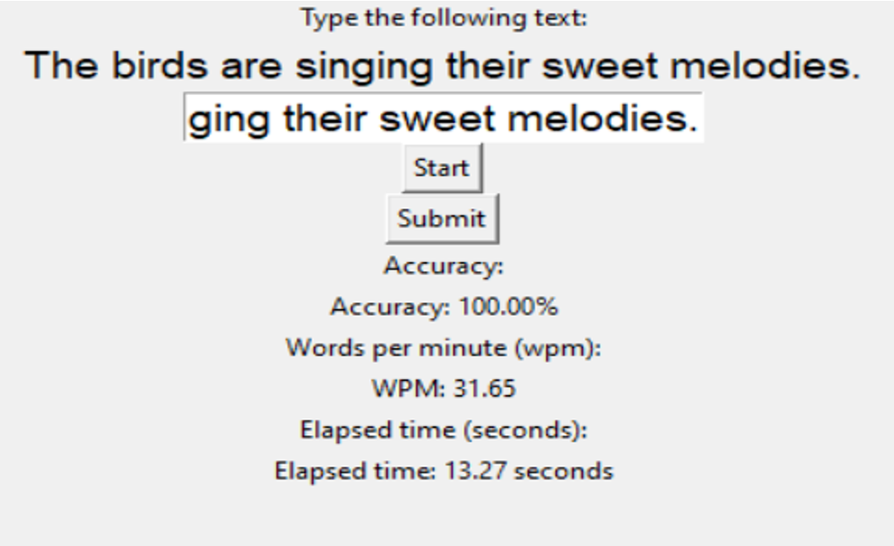

# Speed-Typing-Test
This project aims a Python-based terminal or GUI application that tests your typing speed and accuracy in real-time. Built using Python libraries like tkinter
<html>
<body>
<h1>⌨ Speed Typing Test in Python</h1>

  

    This project is a fun and interactive <strong>Speed Typing Test</strong> built using Python. It helps users test their typing speed (WPM) and accuracy in real time by typing random sentences.
  

  <h2>🚀 Features</h2>
  <ul>
    <li>⏱ Real-time timer</li>
    <li>🧠 Random sentence generation</li>
    <li>✅ WPM and accuracy calculation</li>
    <li>🖥 CLI, Tkinter GUI, or Streamlit Web Interface</li>
  </ul>

  <h2>🛠 Technologies Used</h2>
  <ul>
    <li>Python 3.x</li>
    <li>Tkinter (for GUI)</li>
    <li>time module (for timing)</li>
  </ul>

  <h2>📦 Requirements</h2>
  <pre>
streamlit
tkinter
  </pre>

  
<em>Note: Tkinter and time are standard Python libraries and do not need to be installed separately.</em>

  <h2>▶ How to Run</h2>

  <h3>For Tkinter GUI:</h3>
  <pre>python gui_typing_test.py</pre>

  <h2>📷 Screenshot</h2>
  

  <h2>📁 Project Structure</h2>
  <pre>
speed-typing-test/
├── app.py                # Streamlit App
├── typing_test.py        # Console version
├── gui_typing_test.py    # Tkinter GUI
├── requirements.txt
└── README.html
  </pre>

  <h2>👩‍💻 Author</h2>
  
<strong>Areeza Usmani</strong> 
  

</body>
</html>
